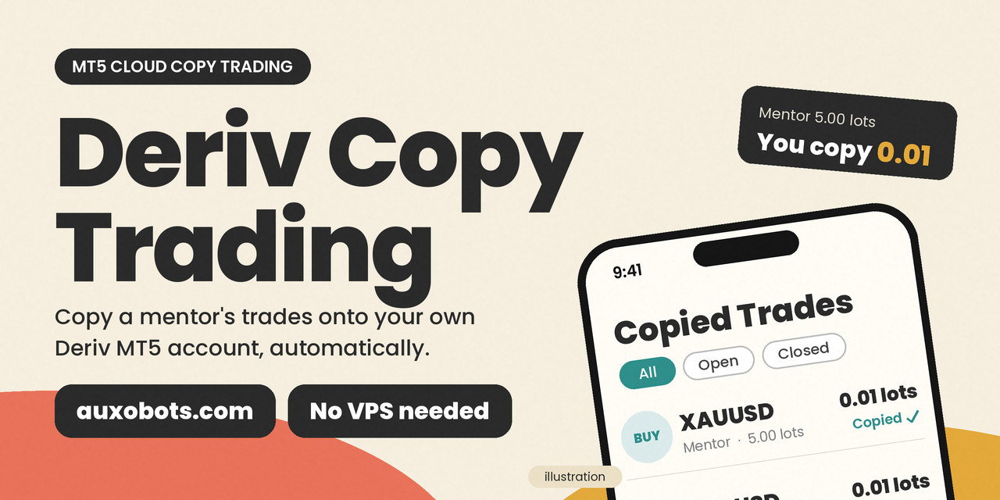

# Deriv Copy Trading (MT5)

Copy trades from a mentor's MT5 account onto your own Deriv MT5 account, automatically. **Auxobots Cloud Copy** runs your MT5 terminals in the cloud, so there is no VPS to rent and no expert advisor to install.

**[Get started with Auxobots Cloud Copy Trading](https://auxobots.com/fx-bots/copy-trading/cloud/)**

## How it works

1. **Add a mentor.** Enter the mentor's MT5 login, server and *investor* password. The investor password is read-only, so nothing can be traded with it.
2. **Connect your account.** Enter your own Deriv MT5 login, password and server. Your password is stored encrypted.
3. **Watch trades copy.** New trades from the mentor appear on your account automatically.

## Features

- Works with Deriv MT5 and other MT5 brokers, including Exness
- Your own lot size, instead of the mentor's
- Choose which symbols to copy, and whether to copy buys, sells or both
- Optional: close your trades when the mentor closes theirs
- Stop and resume copying any time from the dashboard
- Cloud-hosted: no VPS, no EA to install

## FAQ

**Do I need a VPS?** No. Your terminals run on Auxobots servers.

**Can I try it on a demo account?** Yes. Deriv demo accounts work, and starting on demo is a good way to learn how copying behaves before using real money.

**Does it work with other brokers?** Yes. Exness and other MT5 brokers are supported.

**Where do I withdraw money?** Always in your broker's client area, never through Auxobots.

## Risk warning

Trading involves risk, and you can lose money. Copying a trader does not guarantee profit, and past performance does not guarantee future results. Nothing here is financial advice.

## Disclaimer

Auxobots is an independent product. It is not affiliated with, endorsed by or sponsored by Deriv. Deriv and related names are trademarks of their owners.

---

Maintained by [Auxobots](https://auxobots.com).
